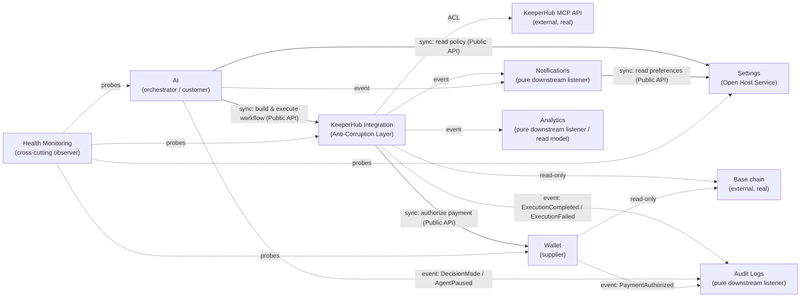
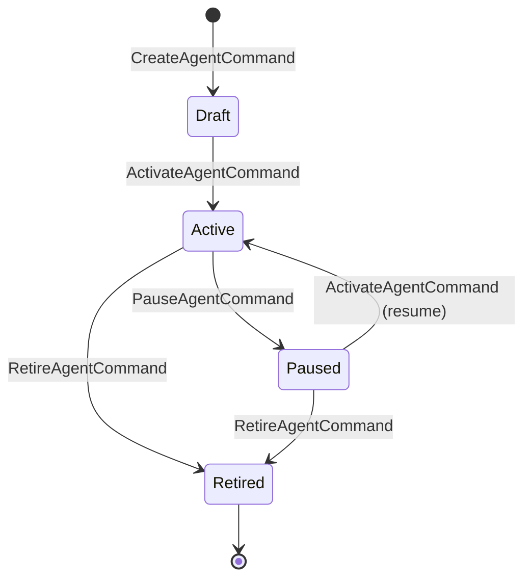
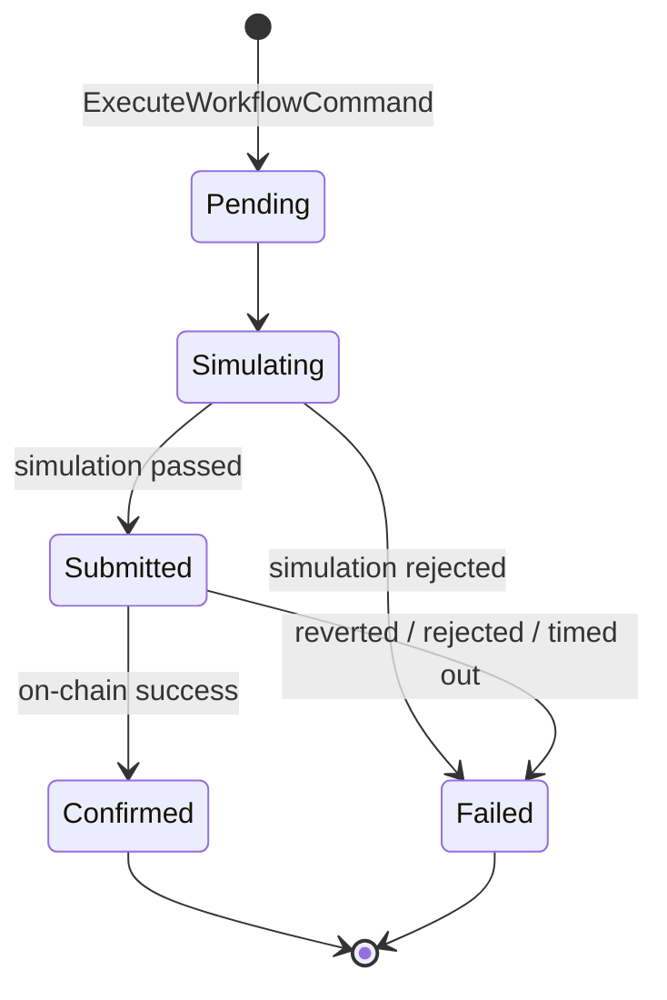

# KeeperHub Platform — Architecture

Status: **COMPLETE (§1-12) — awaiting your review/approval. No implementation until approved.**

This document is written incrementally, in the order listed in [ROADMAP.md](../ROADMAP.md) Phase 0.
Each section is discussed and approved before moving to the next.

---

## 1. Overall System Architecture

### 1.1 Style: Modular Monolith, Hexagonal internals, event-driven between modules

**Decision**: single deployable NestJS process, organized as 8 isolated bounded-context modules.
Each module internally follows Hexagonal Architecture (Ports & Adapters) with DDD tactical
patterns (Entities, Value Objects, Aggregates, Domain Events, Application Services, Repository
Ports). Modules never import each other's internals — they communicate two ways only:

1. **Async, decoupled**: publish/subscribe over an in-process **Domain Event Bus**. This is the
   default. E.g. KeeperHub Integration publishes `ExecutionCompleted`; Audit Logs, Notifications,
   and Analytics each subscribe independently, with no knowledge of each other.
2. **Sync, explicit**: a module may depend on another module's **Public API** — a thin exported
   facade (a handful of application-service methods + DTOs), never its domain or repositories.
   Used sparingly, only where a synchronous answer is required before proceeding (e.g. AI asking
   KeeperHub Integration to execute a workflow and needing the execution ID back immediately).

**Why modular monolith over microservices**: microservices buy you independent deployability and
failure isolation at the cost of network overhead, distributed tracing, service discovery, and
data consistency across service boundaries. None of those costs buy anything for a single-team
hackathon build, and the benefit (independent scaling per module) isn't a real constraint yet.
The architectural discipline this spec asks for (isolated contexts, ports, no leakage) is fully
achievable inside one process — it's a code-organization property, not a deployment-topology one.
Splitting a well-isolated module out into its own service later is a mechanical change (swap the
in-process event bus adapter for a message broker implementing the same port) specifically
*because* we're isolating modules now.

**Why not serverless functions per module**: KeeperHub execution and AI agent orchestration are
inherently long-running/stateful — waiting on execution status polling, retry/backoff loops. That
fights the short-lived, stateless serverless execution model and would need something like Step
Functions to compensate, which is disproportionate operational complexity for what it buys here.

**Why event bus over direct calls as the default**: the modules named in the spec (Audit Logs,
Notifications, Analytics, Health Monitoring) are all fundamentally *reactive* — they exist to
observe what happened elsewhere, not to drive it. Coupling every producer module to every observer
module via direct calls would mean e.g. KeeperHub Integration importing and calling Audit Logs,
Notifications, *and* Analytics directly, and growing that list every time a new observer module is
added. The event bus inverts that: producers publish one event, observers subscribe independently,
producer code never changes when an observer is added or removed.

### 1.2 Composition root

NestJS is the DI container and HTTP layer. `AppModule` imports each of the 8 feature modules plus
a `SharedKernelModule` (event bus, logger, correlation-id context, Prisma client). Each feature
module's `*.module.ts` is the only place wiring happens: it binds Ports to their concrete
Infrastructure adapters via NestJS providers (`{ provide: SomePort, useClass: SomeAdapter }`), and
exports only its Application-layer public API.

### 1.3 External integration points (real systems, not mocks)

| System | What we integrate with | Owned by module |
|---|---|---|
| KeeperHub Remote MCP server (`https://app.keeperhub.com/mcp`) | Workflow CRUD, `execute_workflow`, `get_execution_status`, `list_action_schemas`, plugin discovery. OAuth 2.1 or Bearer `kh_` key. | KeeperHub Integration |
| KeeperHub Agentic Wallet (`@keeperhub/wallet`, Turnkey custody) | Wallet provisioning, x402 (Base/USDC) and MPP (Tempo/USDC.e) payment authorization | Wallet |
| Base (EVM chain) | Read-only confirmation/observability queries (balances, tx receipts) via `viem`, supplementary to what KeeperHub reports | KeeperHub Integration (read adapter), Wallet (balance checks) |
| LangChain | Agent reasoning/orchestration runtime | AI (infrastructure layer only — never touches Domain) |

### 1.4 Module boundary enforcement

Convention alone drifts under deadline pressure, so it's backed by a lint rule from day one, not
retrofitted later: `eslint-plugin-boundaries` (or `import/no-restricted-paths`) configured so a
module can only import from another module's `index.ts` barrel (its Public API), never from
`.../domain/**`, `.../infrastructure/**`, or `.../application/**` of another module directly. CI
fails the build on violation. This is cheap to set up now and is what makes "modules remain
isolated" a checked property instead of a hope.

---

## 2. Folder Structure

Single NestJS application (this is a backend-only project — no frontend package to coordinate
in a monorepo), with per-module internal layering. Chosen over an Nx/monorepo-with-libs setup:
Nx gives you the same boundary enforcement out of the box, but adds tooling overhead (workspace
config, project graph, generators) that isn't earning its cost yet. The `index.ts` barrel +
lint-rule approach above gets ~90% of the benefit. If a module later needs to be extracted to its
own deployable, promoting its folder to a package is mechanical specifically because it's already
isolated.

```
keeperhub-platform/
├── docs/
│   ├── ARCHITECTURE.md            (this file)
│   └── modules/                   (one deep-dive doc per module, filled in as each is built)
├── prisma/
│   └── schema/                    (multi-file schema — one .prisma file per module, one physical DB)
│       ├── settings.prisma
│       ├── audit-logs.prisma
│       ├── wallet.prisma
│       ├── keeperhub-integration.prisma
│       ├── ai.prisma
│       ├── notifications.prisma
│       └── analytics.prisma
├── src/
│   ├── main.ts
│   ├── app.module.ts
│   ├── config/                    (typed, validated env config — no module reads process.env directly)
│   ├── shared/                    (shared kernel — see note below)
│   │   ├── domain/
│   │   │   ├── entity.base.ts
│   │   │   ├── aggregate-root.base.ts
│   │   │   ├── domain-event.base.ts
│   │   │   ├── result.ts                  (Result<T, E> — explicit error handling, no throw-as-control-flow)
│   │   │   └── domain-error.base.ts
│   │   ├── application/
│   │   │   ├── event-bus.port.ts
│   │   │   └── event-bus.module.ts        (in-process pub/sub implementation, swappable later)
│   │   └── infrastructure/
│   │       ├── logger/                    (structured logger, correlation-id aware)
│   │       ├── correlation/               (AsyncLocalStorage-based correlation-id context)
│   │       └── prisma/                    (single PrismaService, injected — no module creates its own client)
│   └── modules/
│       ├── settings/
│       ├── audit-logs/
│       ├── health-monitoring/
│       ├── wallet/
│       ├── keeperhub-integration/
│       ├── ai/
│       ├── notifications/
│       └── analytics/
├── test/
├── .env.example
├── package.json
└── tsconfig.json
```

**Shared kernel note**: the "shared" folder is deliberately tiny — base classes, cross-cutting
infra (logger, correlation, Prisma client), and the event bus contract. It must never contain
business logic or types specific to one module's domain. If two modules seem to need the same
domain concept, that's a signal to model it as a Published Language (an event/DTO contract)
between them, not to hoist a shared domain type — shared domain types are how bounded contexts
quietly merge into a ball of mud.

### 2.1 Per-module internal layout

Every one of the 8 modules follows this identical shape (this uniformity is what "each module
follows the same architectural pattern" means concretely):

```
modules/<module-name>/
├── domain/                a       <- pure TypeScript. Zero imports from Nest, Prisma, LangChain, MCP SDKs.
│   ├── entities/
│   ├── value-objects/
│   ├── events/                     <- domain events this module publishes
│   ├── errors/                     <- domain-specific error types (extend DomainError)
│   └── ports/                      <- interfaces: repository ports + any external-capability ports
├── application/
│   ├── commands/                   <- write use cases (one class per use case)
│   ├── queries/                    <- read use cases
│   └── services/                   <- application services orchestrating domain + ports
├── infrastructure/
│   ├── persistence/                <- Prisma repository implementations of domain/ports repository interfaces
│   ├── external/                   <- adapters for real external systems (KeeperHub MCP client, LangChain runner, Turnkey wallet SDK)
│   └── events/                     <- this module's event-bus subscribers (inbound side)
├── interface/
│   ├── http/                       <- NestJS controllers
│   ├── dto/                        <- request/response DTOs + class-validator decorators
│   └── mappers/                    <- DTO ↔ domain mapping (never expose domain entities directly over HTTP)
├── <module-name>.module.ts         <- NestJS wiring: binds ports to adapters, declares exports
└── index.ts                        <- Public API barrel: the ONLY thing other modules may import
```

The dependency rule is strict and one-directional: `interface → application → domain`,
`infrastructure → domain` (implements its ports). `domain` depends on nothing else in the module.
This is what "Never allow Prisma to leak into the Domain" / "Never allow KeeperHub code inside the
Domain" means as an enforceable structural rule rather than a suggestion: Prisma types only ever
appear inside `infrastructure/persistence/`, the KeeperHub MCP client only inside
`infrastructure/external/` of the KeeperHub Integration module, LangChain only inside
`infrastructure/external/` of the AI module.

---

## 3. Bounded Contexts

| # | Module | Responsibility | Owns (aggregate roots, preview — full model in §4) |
|---|---|---|---|
| 1 | **Settings** | Per-user and per-agent configuration: preferences, feature flags, execution policies (spend limits, allowed actions, gas ceilings) | `AgentPolicy`, `UserPreferences` |
| 2 | **Audit Logs** | Append-only, immutable record of everything material across the platform | `AuditEntry` |
| 3 | **Health Monitoring** | Liveness/readiness of the platform and its external dependencies (DB, KeeperHub MCP, wallet service), agent heartbeat/staleness | `HealthCheckResult` (not persisted as a domain aggregate — mostly a query-time composition, detailed in §6) |
| 4 | **Wallet** | Provisioning and lifecycle of the KeeperHub agentic wallet per agent/user; authorizing x402/MPP payments | `AgentWallet` |
| 5 | **KeeperHub Integration** | Anti-corruption layer around the real external KeeperHub MCP API: workflow CRUD, execution triggering, status/log retrieval | `Workflow`, `Execution` |
| 6 | **AI** | The AI Agent itself: what it monitors, what rules it evaluates, its lifecycle, and its decisions | `Agent`, `Decision` |
| 7 | **Notifications** | Delivering outcome/status alerts across channels, per user notification preferences | `Notification`, `NotificationChannel` |
| 8 | **Analytics** | Derived/aggregated read-models over execution and audit history | `ExecutionMetric` (materialized view, not a transactional aggregate) |

### 3.1 Context Map

Relationships use standard DDD context-mapping patterns, so it's explicit *how* two modules are
allowed to relate, not just that they do:



**Relationship types, explicitly:**

- **KeeperHub Integration → KeeperHub MCP API**: Anti-Corruption Layer. We don't control the
  upstream API's shape; the module's job is to translate it into our own `Workflow`/`Execution`
  domain model so a change upstream (or a future switch to a different execution engine) is
  contained to this one module's `infrastructure/external/`.
- **Settings → {AI, Notifications, KeeperHub Integration}**: Open Host Service. Settings exposes a
  small, stable, read-mostly Public API (`getAgentPolicy(agentId)`, `getUserPreferences(userId)`)
  that consumers conform to. Settings never calls into its consumers.
- **Wallet → KeeperHub Integration**: Customer/Supplier. KeeperHub Integration is a customer
  needing Wallet's payment-authorization capability before it can submit x402/MPP-gated actions;
  Wallet's Public API contract is designed around that need.
- **AI → KeeperHub Integration**: Customer/Supplier. AI is the upstream customer driving workflow
  creation/execution; KeeperHub Integration's Public API is shaped around what AI needs to invoke.
- **{KeeperHub Integration, AI, Wallet} → {Audit Logs, Notifications, Analytics}**: Published
  Language via versioned Domain Events over the event bus. This is deliberately the loosest
  coupling in the system: producers never know who's listening, and the three listener modules
  never call back into producers. Event schemas are treated as a stable contract (versioned,
  reviewed on change) precisely because breaking them silently breaks three modules at once.
- **Health Monitoring → everything**: each module optionally implements a small
  `HealthIndicator` port; Health Monitoring's Public API aggregates them at query time. Health
  Monitoring holds no business data of its own.

**Why Audit Logs, Notifications, and Analytics only ever consume events (never get called
directly, never call back)**: this is what makes them safely optional at runtime — if Analytics is
down, executions still complete; if Notifications is slow, it doesn't block AI decision-making.
That resilience property falls out of the event-driven relationship, not by policy.

---

## 4. Domain Model, Aggregate Roots, and Entity Relationships

### 4.0 Two rules applied consistently across every module below

1. **Aggregates reference other bounded contexts only by opaque ID** (`agentId: string`, never a
   loaded `Agent` object). There is no cross-module object graph and no cross-module Prisma
   `include`/join, even though all modules share one physical database — each module's repository
   queries only the tables it owns. Data another module needs from a cross-context reference is
   either fetched through that module's Public API at the Application layer, or denormalized in
   locally via the event it received (see Analytics, §4.8) — never joined at the SQL layer.
2. **An aggregate boundary is drawn at the actual consistency requirement, not at "things that
   feel related."** Where two records grow together but have no invariant requiring atomic
   consistency between them (e.g. a wallet and its ever-growing history of payments), they are
   *separate* aggregate roots referencing each other by ID — otherwise the aggregate becomes
   unboundedly large and every unrelated update contends on the same lock. This shows up
   repeatedly below (Wallet/PaymentAuthorization, Workflow/Execution, Agent/Decision) — it's the
   single most common aggregate-boundary mistake, so it's worth flagging as a deliberate pattern.

### 4.1 Settings

```typescript
// AgentPolicy — aggregate root. One per agent. Enforced by KeeperHub Integration
// and Wallet before any execution/payment proceeds.
class AgentPolicy {
  id: AgentPolicyId
  agentId: AgentId                    // opaque reference to AI's Agent
  spendLimit: Money                   // e.g. { amount: 500, currency: 'USDC' }
  allowedActions: ActionScope[]       // whitelist, e.g. ['transfer', 'contract_call']
  gasCeiling: GasCeiling              // max acceptable gas price
  executionWindow?: TimeWindow        // optional allowed hours/days
  status: 'active' | 'suspended'
  version: number                     // optimistic concurrency on policy edits
}

// UserPreferences — aggregate root. One per user. Independent lifecycle from
// AgentPolicy: a user's timezone/notification prefs change on a different
// cadence than any single agent's spend policy, so bundling them would create
// false contention (every policy edit locking the whole preference set).
class UserPreferences {
  id: UserPreferencesId
  userId: UserId
  notificationPreferences: NotificationPreference[]   // VO: { channel, enabled }
  timezone: Timezone
}

// PlatformSettings — aggregate root, singleton row. Ops-driven feature flags,
// separate from the above because it changes on a third, independent cadence
// (deploys/ops), not user or agent action.
class PlatformSettings {
  id: 'singleton'
  featureFlags: Record<string, boolean>
}
```

### 4.2 Audit Logs

```typescript
// AuditEntry — aggregate root, but a leaf: no child entities, no mutation
// port exposed at all (append-only is enforced by omission, not by a check).
class AuditEntry {
  id: AuditEntryId
  correlationId: CorrelationId        // ties one causal chain across modules/logs/traces
  occurredAt: Date
  actor: { type: 'system' | 'agent' | 'user'; id: string }
  eventType: string                   // e.g. 'ExecutionCompleted', matches the event bus contract
  subject: { type: string; id: string }  // what this entry is about
  payload: Record<string, unknown>    // schema-versioned per eventType, see §21
  severity: 'info' | 'warning' | 'critical'
}
```

### 4.3 Health Monitoring

Deliberately **not** a rich domain with business invariants — it's a cross-cutting observer.

```typescript
// MonitoredComponentStatus — entity, persisted. Populated two ways: active
// probes (infra dependencies) and passive events relayed over the bus
// (e.g. an agent heartbeat). This keeps Health Monitoring a pure observer —
// it never calls into AI to ask "are you alive", AI tells it via an event.
class MonitoredComponentStatus {
  componentId: string                 // 'db' | 'keeperhub-mcp' | 'wallet-service' | an agentId
  componentType: 'infra' | 'agent'
  status: 'up' | 'degraded' | 'down'
  lastSeenAt: Date
  consecutiveFailures: number
}

// HealthCheckResult — value object, computed on demand, never persisted.
// Returned by the aggregating query at request time.
type HealthCheckResult = {
  indicatorName: string
  status: 'up' | 'degraded' | 'down'
  latencyMs: number
  checkedAt: Date
}
```

### 4.4 Wallet

```typescript
// AgentWallet — aggregate root. One per agent.
class AgentWallet {
  id: AgentWalletId
  agentId: AgentId
  turnkeySubOrgId: TurnkeySubOrgId     // VO
  evmAddress: EvmAddress               // VO, checksum-validated
  hmacSecretRef: SecretRef             // VO: a *reference* to the secret's location
                                        // (e.g. secrets-manager key path) — the raw
                                        // HMAC value and signing key never enter our DB
                                        // or this object; signing key material stays in
                                        // Turnkey's enclave (see §25 Security Architecture)
  paymentProtocolPreference: 'x402' | 'mpp' | 'auto'
  status: 'provisioning' | 'active' | 'suspended' | 'revoked'
}

// PaymentAuthorization — separate aggregate root (see §4.0 rule 2). References
// AgentWallet and Execution by ID only. Spend-limit enforcement (does this
// authorization keep the agent under its AgentPolicy.spendLimit) is an
// Application-layer concern: it loads AgentWallet for status, then runs a
// SUM query against this table via the repository port — it does not load
// full authorization history into the AgentWallet aggregate to check it.
class PaymentAuthorization {
  id: PaymentAuthorizationId
  agentWalletId: AgentWalletId
  executionId: ExecutionId             // opaque reference into KeeperHub Integration
  protocol: 'x402' | 'mpp'
  amount: Money
  status: 'authorized' | 'settled' | 'failed'
  authorizedAt: Date
  settledAt?: Date
}
```

### 4.5 KeeperHub Integration

```typescript
// Workflow — aggregate root. Our domain representation of a KeeperHub
// workflow graph; the ACL translates to/from KeeperHub's wire format in
// infrastructure/external, never here.
class Workflow {
  id: WorkflowId                       // our internal ID, stable even before KeeperHub sync
  keeperhubWorkflowId?: KeeperHubWorkflowId  // external ID, present once synced
  agentId: AgentId
  nodes: WorkflowNode[]                 // VO: trigger/action node definitions
  edges: WorkflowEdge[]                 // VO
  status: 'draft' | 'synced' | 'active' | 'archived'
  version: number
}

// Execution — separate aggregate root (see §4.0 rule 2): a Workflow can be
// executed arbitrarily many times, so Execution must not be a child collection
// loaded with Workflow every time.
class Execution {
  id: ExecutionId
  workflowId: WorkflowId
  keeperhubExecutionId?: KeeperHubExecutionId
  triggeredBy: 'manual' | 'agent_decision' | 'schedule'
  status: 'pending' | 'simulating' | 'submitted' | 'confirmed' | 'failed'
  transactionHash?: TransactionHash
  gasUsed?: GasAmount
  logs: ExecutionLogEntry[]            // child entity — OK inside this aggregate:
                                        // naturally bounded (one entry per lifecycle
                                        // step: triggered/simulated/submitted/confirmed),
                                        // unlike Execution itself relative to Workflow.
  startedAt: Date
  completedAt?: Date
}
```

### 4.6 AI

```typescript
// Agent — aggregate root. The thing the whole platform is about.
class Agent {
  id: AgentId
  ownerId: UserId
  name: AgentName
  monitoredTrigger: TriggerDefinition   // VO: what event/condition it watches
  rules: Rule[]                         // VO list: condition -> action intent
  status: 'draft' | 'active' | 'paused' | 'retired'
  lastActiveAt: Date
  version: number
}

// Decision — separate aggregate root (see §4.0 rule 2): unbounded history per
// agent. This is the record of "why did the AI do what it did" — the single
// most important entity for judges evaluating AI decision-making, so its
// rationale field is not optional or an afterthought.
class Decision {
  id: DecisionId
  agentId: AgentId
  triggerContext: Record<string, unknown>   // snapshot of the data evaluated
  outcome: 'execute' | 'skip' | 'blocked'
  rationale: string                          // human-readable explanation
  resultingExecutionId?: ExecutionId         // set only when outcome = 'execute'
  evaluatedAt: Date
}
```

### 4.7 Notifications

```typescript
// NotificationChannel — aggregate root. Per-user configured delivery channel.
class NotificationChannel {
  id: NotificationChannelId
  userId: UserId
  channelType: 'email' | 'webhook' | 'in_app'
  config: Record<string, unknown>       // e.g. { webhookUrl } or { emailAddress }
  enabled: boolean
}

// Notification — separate aggregate root: one delivery record, unbounded
// growth per channel.
class Notification {
  id: NotificationId
  channelId: NotificationChannelId
  subjectEventType: string
  payload: Record<string, unknown>
  deliveryStatus: 'pending' | 'delivered' | 'failed'
  attempts: number
}
```

### 4.8 Analytics

Deliberately **not** modeled as a true aggregate with invariants — this is a materialized
read-model, written only by event-bus subscribers, never through a command API with business
rules. If it's ever wrong or lost, it is fully rebuildable by replaying Audit Logs' event history
— that rebuildability is the actual design goal here, not enforcing consistency.

```typescript
// ExecutionMetric — projection row, not an aggregate.
type ExecutionMetric = {
  periodId: string                      // e.g. day bucket '2026-07-06'
  agentId: AgentId
  agentName: string                      // denormalized copy from AgentCreated/AgentRenamed
                                          // event — deliberately not joined to AI's table
  totalExecutions: number
  successCount: number
  failureCount: number
  totalGasUsed: bigint
  totalValueMoved: Money
}
```

### 4.9 Cross-module entity relationship summary

```
User ──< UserPreferences (Settings)
User ──< NotificationChannel (Notifications)
User ──< Agent (AI)                                    [by userId, opaque]

Agent ──1:1── AgentPolicy (Settings)                    [by agentId, opaque]
Agent ──1:1── AgentWallet (Wallet)                      [by agentId, opaque]
Agent ──< Decision (AI)
Agent ──< Workflow (KeeperHub Integration)               [by agentId, opaque]

Workflow ──< Execution (KeeperHub Integration)
Execution ──0:1── PaymentAuthorization (Wallet)          [by executionId, opaque]
Decision ──0:1── Execution (KeeperHub Integration)       [via resultingExecutionId]

(everything) ──> AuditEntry (Audit Logs)                 [via events, not FK]
(everything) ──> ExecutionMetric (Analytics)             [via events, not FK]
(everything) ──> Notification (Notifications)            [via events, not FK]
```

All `──<` and `──` relationships that cross a module boundary are **ID references only** — there
is no Prisma relation/foreign-key constraint declared across module-owned tables, even in the
single shared database. This is enforced by keeping each module's `.prisma` file free of `@relation`
fields pointing at another module's model; referential integrity for cross-module IDs is a domain
concern (an application service validates the referenced ID resolves before proceeding), not a
database one.

---

## 5. Application Services, Repository Ports, and Infrastructure Adapters

### 5.0 Three kinds of "port" — don't conflate them

The spec asks for "repository ports" and "infrastructure adapters" as if there's one kind of each,
but three distinct things show up under "port" across these modules, and mixing them up is a
common source of leaky abstractions:

1. **Repository Ports** — persistence only (`findById`, `save`). Always module-owned, always
   implemented by a Prisma adapter in that module's `infrastructure/persistence/`.
2. **External Capability Ports** — access to a real third-party system that isn't persistence:
   `KeeperHubClientPort`, `WalletSigningPort`, `AgentReasoningPort`, `ChainReaderPort`,
   `NotificationDeliveryPort`. These are where the Anti-Corruption Layer pattern lives — the port
   interface is phrased entirely in our domain's terms, and only the adapter behind it knows about
   MCP/Turnkey/LangChain/viem wire formats.
3. **Public API** — not a "port" in the hexagonal sense at all (nothing external implements it); it's
   the Application-layer facade another *module* is allowed to call synchronously. Covered in §1.1/§1.4.

Every module's `.module.ts` binds (1) and (2) via NestJS DI tokens; only (3) is exported.

### 5.1 Settings

- **Application services**: `GetAgentPolicyQuery`, `UpdateAgentPolicyCommand`,
  `GetUserPreferencesQuery`, `UpdateUserPreferencesCommand`, `GetFeatureFlagsQuery`
- **Repository ports**: `AgentPolicyRepository` (findByAgentId, save), `UserPreferencesRepository`
  (findByUserId, save), `PlatformSettingsRepository` (get, save)
- **Infrastructure adapters**: `PrismaAgentPolicyRepository`, `PrismaUserPreferencesRepository`,
  `PrismaPlatformSettingsRepository`
- **Public API**: `getAgentPolicy(agentId)`, `getUserPreferences(userId)`, `isFeatureEnabled(flag)`

### 5.2 Audit Logs

- **Application services**: `RecordAuditEntryCommand` (never exposed over HTTP — only ever
  invoked from `infrastructure/events` subscribers reacting to the bus), `QueryAuditTrailQuery`
  (filters: correlationId, subjectId, eventType, date range; paginated)
- **Repository ports**: `AuditEntryRepository` (append, findByCorrelationId, query)
- **Infrastructure adapters**: `PrismaAuditEntryRepository`;
  `AuditEventSubscriber` — subscribes to every published domain event (by convention, all events
  extend the shared `DomainEvent` base and carry `eventType` + `correlationId`), maps each to an
  `AuditEntry` via a small per-event-type mapper registry, so adding a new event type elsewhere in
  the platform doesn't require touching Audit Logs' code, only registering a mapper.
- **Public API**: `queryAuditTrail(filter)` — read-only, no write API exposed to other modules

### 5.3 Health Monitoring

- **Application services**: `GetSystemHealthQuery` (aggregates all registered health indicators +
  `MonitoredComponentStatus` rows), internal `RecordHeartbeatCommand` (invoked by an event
  subscriber on agent heartbeat events)
- **Repository ports**: `MonitoredComponentStatusRepository` (upsert, findAll, findByComponentId)
- **Cross-cutting port worth calling out**: `HealthIndicatorPort` is defined *by* Health
  Monitoring but *implemented by other modules* — e.g. `KeeperHubConnectivityHealthIndicator`
  physically lives in the KeeperHub Integration module's infrastructure layer (it's the one that
  knows how to cheaply check MCP reachability) but implements Health Monitoring's exported
  interface and registers itself via a NestJS multi-provider token
  (`{ provide: HEALTH_INDICATOR, useClass: ..., multi: true }`). This is the one place a module
  reaches "backward" into another's port — deliberately, since Health Monitoring must never
  hardcode knowledge of every other module's internals to know how to check them.
- **Public API**: `getSystemHealth()`

### 5.4 Wallet

- **Application services**: `ProvisionAgentWalletCommand`, `AuthorizePaymentCommand` (loads
  `AgentWallet` for status, calls Settings' Public API to check the `AgentPolicy` spend limit,
  queries `sumAuthorizedAmount` rather than loading full history — see §4.0), `GetWalletBalanceQuery`
- **Repository ports**: `AgentWalletRepository` (findById, findByAgentId, save),
  `PaymentAuthorizationRepository` (save, sumAuthorizedAmount(agentWalletId, since))
- **External capability ports**: `WalletSigningPort` (provision, authorizePayment),
  `ChainReaderPort` (getBalance)
- **Infrastructure adapters**: `PrismaAgentWalletRepository`, `PrismaPaymentAuthorizationRepository`;
  `KeeperHubWalletAdapter` (implements `WalletSigningPort`, wraps `@keeperhub/wallet` — Turnkey
  sub-org provisioning, x402/MPP authorization); `ViemChainReaderAdapter` (implements
  `ChainReaderPort` via `viem` against Base)
- **Public API**: `authorizePayment(agentWalletId, executionId, amount, protocol)`,
  `getWalletStatus(agentId)`

### 5.5 KeeperHub Integration

- **Application services**: `CreateWorkflowCommand`, `ExecuteWorkflowCommand` (calls Wallet's
  Public API to authorize payment *before* calling MCP `execute_workflow`), `PollExecutionStatusJob`
  (scheduled — calls MCP `get_execution_status`, updates `Execution`, appends
  `ExecutionLogEntry`, emits `ExecutionCompleted`/`ExecutionFailed` on terminal state — see §16),
  `ListActionSchemasQuery` (proxies MCP `list_action_schemas`, consumed by AI when generating workflows)
- **Repository ports**: `WorkflowRepository` (findById, findByAgentId, save), `ExecutionRepository`
  (findById, findByWorkflowId, save)
- **External capability port**: `KeeperHubClientPort` (createWorkflow, executeWorkflow,
  getExecutionStatus, listActionSchemas) — phrased in our domain's terms; the adapter alone knows
  the MCP wire format
- **Infrastructure adapters**: `PrismaWorkflowRepository`, `PrismaExecutionRepository`;
  `KeeperHubMcpClientAdapter` (implements `KeeperHubClientPort`, HTTP client against
  `https://app.keeperhub.com/mcp` with Bearer `kh_` auth, translates Workflow/Execution ⇄
  KeeperHub's node/edge wire schema — this is the Anti-Corruption Layer in code)
- **Public API**: `createWorkflow(agentId, nodes, edges)`, `executeWorkflow(workflowId, triggeredBy)`,
  `getExecution(executionId)`, `listActionSchemas()`

### 5.6 AI

- **Application services**: `CreateAgentCommand`, `ActivateAgentCommand`/`PauseAgentCommand`/
  `RetireAgentCommand` (lifecycle transitions, §15), `EvaluateTriggerCommand` (loads `Agent` +
  its `AgentPolicy` via Settings' Public API, runs reasoning, creates `Decision`, and — only when
  outcome is `execute` — calls KeeperHub Integration's `executeWorkflow` synchronously so the
  resulting `executionId` can be recorded on the `Decision` itself), `GenerateWorkflowFromIntentCommand`
  (natural-language → draft workflow, using `listActionSchemas()` so the AI only ever proposes
  actions KeeperHub can actually run)
- **Repository ports**: `AgentRepository` (findById, findByOwnerId, save), `DecisionRepository`
  (findById, findByAgentId, save)
- **External capability port**: `AgentReasoningPort` (`evaluate(agent, triggerContext,
  availableActions) → { outcome, rationale }`, `generateWorkflow(prompt, availableActions) →
  draft nodes/edges`)
- **Infrastructure adapters**: `PrismaAgentRepository`, `PrismaDecisionRepository`;
  `LangChainReasoningAdapter` (implements `AgentReasoningPort` — the only place LangChain is
  imported in this module)
- **Public API**: `createAgent(...)`, lifecycle commands, `getAgent(agentId)`

### 5.7 Notifications

- **Application services**: `RegisterNotificationChannelCommand`, `SendNotificationCommand`
  (internal — invoked by event subscribers on `ExecutionCompleted`/`ExecutionFailed`/`AgentPaused`
  etc.; checks `UserPreferences` via Settings' Public API before sending), `ListNotificationsQuery`
- **Repository ports**: `NotificationChannelRepository`, `NotificationRepository` (save,
  findPendingForRetry)
- **External capability port**: `NotificationDeliveryPort` (`deliver(channel, notification) →
  success/failure`), one implementation per channel type
- **Infrastructure adapters**: `PrismaNotificationChannelRepository`, `PrismaNotificationRepository`;
  `EmailDeliveryAdapter`, `WebhookDeliveryAdapter` (both implement `NotificationDeliveryPort`)
- **Public API**: `registerChannel(...)`, `listNotifications(userId)`

### 5.8 Analytics

- **Application services**: `RecordExecutionMetricCommand` (internal — invoked only by event
  subscribers on `ExecutionCompleted`/`ExecutionFailed`, upserts the relevant period bucket),
  `GetAgentAnalyticsQuery`, `GetPlatformAnalyticsQuery`
- **Repository ports**: `ExecutionMetricRepository` (upsertForPeriod, query)
- **Infrastructure adapters**: `PrismaExecutionMetricRepository`
- **Public API**: `getAgentAnalytics(agentId, dateRange)`, `getPlatformAnalytics(dateRange)` —
  read-only; there is deliberately no write path into this module except via events (§4.8)

---

## 6. API Endpoints, DTOs, and Validation Strategy

### 6.1 API endpoints (REST, `/api/v1`, one controller per module)

| Module | Endpoints |
|---|---|
| Settings | `GET/PATCH /agents/:agentId/policy`, `GET/PATCH /users/:userId/preferences`, `GET /feature-flags` |
| Audit Logs | `GET /audit-log?correlationId=&subjectId=&eventType=&from=&to=&page=` (read-only — no write endpoint exists) |
| Health Monitoring | `GET /health/live`, `GET /health/ready`, `GET /health/components` |
| Wallet | `POST /agents/:agentId/wallet` (provision), `GET /agents/:agentId/wallet`, `GET /agents/:agentId/wallet/balance` (payment authorization is **not** a public endpoint — internal only, invoked from KeeperHub Integration's application layer) |
| KeeperHub Integration | `POST /agents/:agentId/workflows`, `GET /workflows/:workflowId`, `POST /workflows/:workflowId/executions`, `GET /executions/:executionId`, `GET /action-schemas` |
| AI | `POST /agents`, `GET /agents/:agentId`, `GET /users/:userId/agents`, `POST /agents/:agentId/activate`\|`pause`\|`retire`, `POST /agents/:agentId/generate-workflow`, `GET /agents/:agentId/decisions` |
| Notifications | `POST /users/:userId/notification-channels`, `GET /users/:userId/notifications` |
| Analytics | `GET /agents/:agentId/analytics?from=&to=`, `GET /analytics/platform?from=&to=` |

### 6.2 DTO strategy

- Every endpoint has an explicit **Request DTO** (`CreateAgentDto`, `UpdateAgentPolicyDto`, ...)
  decorated with `class-validator`. Domain entities are never bound directly to a request body.
- Every response passes through an explicit **Response DTO**, built by a mapper in
  `interface/mappers/`, never by serializing the domain entity directly. This is what keeps a
  refactor of an internal domain field from silently becoming a breaking API change, and stops
  domain methods/internal invariants from leaking onto the wire.
- Pagination is a shared shape (`{ items, page, pageSize, total }`) used identically wherever a
  list endpoint exists (Audit Logs, Notifications, Decisions), defined once in `shared/`.

### 6.3 Validation strategy — two layers, enforced at different points, for different reasons

1. **Boundary validation** (`interface` layer): a global `ValidationPipe` with
   `whitelist: true, forbidNonWhitelisted: true, transform: true` rejects structurally invalid
   input — wrong type, missing required field, unknown extra field, invalid enum value — before it
   reaches the Application layer at all. This is purely shape-checking; it knows nothing about
   business rules.
2. **Domain invariant validation**: business rules are enforced inside domain entities/value
   objects at construction time — `Money` rejects a negative amount, `EvmAddress` validates EIP-55
   checksum, `AgentPolicy` rejects a zero/negative `spendLimit` — and they throw a `DomainError`
   subclass, not a framework validation error. This layer matters because **not every code path
   goes through HTTP**: a scheduled job (`PollExecutionStatusJob`) or an event subscriber
   (`SendNotificationCommand`) can construct or mutate a domain object without ever passing
   through a `ValidationPipe`, so the invariant has to live in the domain object itself to be
   actually enforced everywhere, not just at the HTTP edge.

A single shared `DomainExceptionFilter` (in `shared/interface/filters/`) maps `DomainError`
subclasses to HTTP status codes once, platform-wide — `NotFoundError → 404`, `ValidationError →
400`, `ConflictError → 409` (e.g. optimistic-concurrency version mismatch), `ForbiddenError → 403`
— so no module reinvents its own HTTP status mapping.

---

## 7. Authentication Flow and Authorization Model

### 7.1 A scope decision worth flagging explicitly

None of the 8 named modules owns user identity/login — they all assume a `User` already exists.
**Built in Phase 2 as `src/modules/identity/`** — a full first-class module with the same
domain/application/infrastructure/interface layering as every other module (revised from this
doc's original sketch of a special-cased `shared/infrastructure/identity/` with no internal
layering, once it became clear that location would force real business rules — email uniqueness,
password policy — into a folder our own convention reserves for adapters). Placing it under
`modules/` also means it's automatically covered by the `eslint-plugin-boundaries` rule with no
special-casing. It exposes a `JwtAuthGuard` and `@CurrentUser()` decorator (via its `index.ts`
public API) that every other module's controllers import. API-key auth for machine callers is
deferred until KeeperHub Integration's webhook trigger endpoint actually needs it.

### 7.2 Authentication flow

- **Human users** (dashboard/API access): email + password (bcrypt) → short-lived JWT access token
  (15 min) + a rotated refresh token (opaque, stored hashed, httpOnly cookie). NestJS Passport JWT
  strategy validates the access token on every protected route.
- **Machine/webhook callers** (external systems firing an agent's monitored trigger, e.g. a price
  feed webhook): a per-agent API key (`kh_agent_<random>`, stored hashed, never in plaintext after
  issuance), validated by a separate custom `ApiKeyGuard`. Kept distinct from user JWTs because
  the caller isn't a person and shouldn't be able to touch human-only endpoints like preferences.

### 7.3 Authorization model — two distinct layers

This domain has an authorization question the spec's module list doesn't say out loud but the
system can't work without: **who may configure an agent** is a different question from **what an
already-configured agent may autonomously do on-chain**. Conflating them would mean either humans
are over-restricted or agents are under-restricted.

1. **Human/API-key authorization** (config-time): RBAC (`user` | `admin`, `admin` reserved for
   platform operators) plus resource ownership. Ownership is resolved through AI's Public API
   (only the AI module can answer "who owns this `agentId`") — a small reusable
   `OwnershipGuard` factory in `shared/` takes a resolver function per resource type, so Wallet's
   `GET /agents/:agentId/wallet` and KeeperHub Integration's endpoints reuse the same guard
   without hardcoding a cross-module lookup themselves.
2. **Agent execution authorization** (run-time): governed entirely by Settings'
   `AgentPolicy.allowedActions`, `spendLimit`, and `gasCeiling` — enforced by KeeperHub Integration
   immediately before calling `execute_workflow`, and by Wallet before authorizing payment. An
   agent with an active status but no matching policy entry for a requested action is rejected
   regardless of what the AI module decided — the human-authored policy is the last word, not the
   AI's decision. This is the platform's actual safety mechanism for autonomous execution, so it's
   enforced at the KeeperHub Integration/Wallet boundary, not just trusted from upstream.

---

## 8. Agent Lifecycle, KeeperHub Execution Lifecycle, and Transaction Lifecycle

### 8.1 Agent lifecycle



- **Draft**: freely editable (rules, trigger definition) since nothing is watching yet.
- **Draft → Active**: `ActivateAgentCommand` requires an `AgentPolicy` to exist (Settings) *and*
  an `AgentWallet` in `active` status (Wallet) — an agent cannot go live without both a policy
  bounding what it may do and a funded, working wallet to pay for executions. Begins evaluating
  `monitoredTrigger`.
- **Active → Paused**: either user-initiated, or system-initiated on repeated execution failure
  (see §10 Failure Recovery) — an auto-pause is itself a `Decision`-adjacent event so it shows up
  in the audit trail with a reason, not a silent state change.
- **Editing rules/trigger is only permitted in `Draft` or `Paused`**, never `Active`. This is
  deliberate: allowing a live edit mid-evaluation would make it ambiguous which rule version
  produced a given `Decision`, which directly undermines the audit trail. `Agent.version`
  increments on every edit, and each `Decision` records the `agentVersion` it was evaluated
  against.
- **Retired is terminal.** Retiring archives the agent's `Workflow`(s) in KeeperHub Integration
  (`status → archived`) and stops all future trigger evaluation; history (`Decision`, `Execution`)
  is retained, never deleted.

### 8.2 KeeperHub execution lifecycle — Workflow and Execution together

Two lifecycles, deliberately separate (per §4.0's aggregate-boundary rule: one `Workflow` has many
`Execution`s).

**Workflow:**
```
Draft --(CreateWorkflowCommand pushes to KeeperHub MCP)--> Synced --> Active --> Archived
```
`Draft` is our locally-defined node/edge graph before it exists on KeeperHub at all. `Synced` means
`keeperhubWorkflowId` is populated. `Active` means the owning Agent is Active and this is its
current workflow. `Archived` is terminal (superseded by a new workflow version, or the owning
agent retired).

**Execution** (one run of a workflow):


- **Pending**: `Execution` row created; payment authorization requested from Wallet's Public API
  *before* anything is sent to KeeperHub — an execution that can't be paid for never reaches
  simulation.
- **Simulating → Submitted/Failed**: KeeperHub simulates before submitting (this matches their own
  documented audit trail shape — "trigger, simulation result, submitted transaction, gas used,
  outcome, timestamp" — so our `ExecutionLogEntry` records mirror exactly those steps). A rejected
  simulation fails the `Execution` *before* it ever has a `transactionHash`.
- **Submitted → Confirmed/Failed**: driven by `PollExecutionStatusJob` calling MCP
  `get_execution_status` until a terminal state (retry/backoff policy in §9). Terminal state and
  `transactionHash`/`gasUsed` are written onto `Execution`, and `ExecutionCompleted` /
  `ExecutionFailed` is published — this is the single event that Audit Logs, Notifications, and
  Analytics all key off of.

### 8.3 Transaction lifecycle — and an explicit boundary we do *not* cross

The on-chain transaction is a sub-concept of `Execution`, not a separate aggregate — `Execution`
carries `transactionHash` and `gasUsed` once they exist. Two distinct ways `Execution` ends up
`Failed` matter for the audit trail and are recorded as different `ExecutionLogEntry` reasons:

1. **Never got a transaction hash** — simulation was rejected, or submission itself errored.
2. **Got a transaction hash, then reverted on-chain** — included/mined, but the transaction itself
   failed. This is a meaningfully different failure mode (gas was spent) from (1) and must be
   distinguishable when a judge or user is reading the audit trail.

**Deliberate non-responsibility**: KeeperHub's own smart gas estimation, private/MEV-protected
routing, and stuck-transaction handling ("adapts to congestion with exponential backoff, so
transactions execute instead of getting stuck") already own gas-bumping, resubmission, and
nonce management once a transaction is submitted. We do **not** reimplement any of that — our
`Execution` simply stays `Submitted` and polls until KeeperHub reports a terminal outcome. Trying
to duplicate stuck-tx recovery on our side would fight the system we're specifically integrating
with for that exact capability, and would create two sources of truth for one transaction's nonce.

---

## 9. Retry Strategy, Gas Optimization Strategy, Failure Recovery Strategy

### 9.1 Retry strategy — and the correctness trap most hackathon builds fall into

A shared `RetryPolicy` (maxAttempts, baseDelayMs, backoffMultiplier, jitter) lives in
`shared/infrastructure/`, applied consistently, with errors classified as `Retryable` (network
errors, timeouts, 5xx) vs `NonRetryable` (any `DomainError` — a `ValidationError` or
`ForbiddenError` retried blindly just fails identically N times).

**The trap**: `execute_workflow` is **not idempotent** — calling it twice means two real on-chain
transactions, not one. A naive "retry on timeout" wrapped around it can silently double-spend on a
network blip where the request actually reached KeeperHub but the response was lost. Because this
platform moves real money, that failure mode is treated as a correctness bug, not an edge case:

- `ExecuteWorkflowCommand` never blind-retries the MCP `execute_workflow` call itself.
- On a timeout/ambiguous response, before retrying we first call `get_execution_status` using our
  own `Execution.id` correlation (KeeperHub's `list_action_schemas`/execution endpoints support
  querying by caller-supplied reference) to check whether an execution was already created
  server-side. Only if none exists do we retry the submission.
- `get_execution_status` (used by `PollExecutionStatusJob`) and all other read calls *are*
  naturally idempotent and retried freely with standard backoff.
- Notification delivery retries independently (already covered in §5.7 —
  `findPendingForRetry`), capped at N attempts before landing in `failed` permanently and
  surfacing as a Health Monitoring signal, not a silent drop.

### 9.2 Gas optimization strategy — mostly deliberate deference

KeeperHub already provides smart gas estimation ("adapts to congestion with exponential backoff,
so transactions execute instead of getting stuck") and, per §8.3, we don't reimplement any of that.
What this platform *does* own on top of it:

- **`AgentPolicy.gasCeiling` as a pre-submission gate**: after KeeperHub's simulation returns an
  estimated gas cost, KeeperHub Integration checks it against the agent's configured ceiling
  *before* proceeding to submission — this is a user-configured spending guardrail layered on top
  of KeeperHub's estimation, not a competing estimation strategy.
- **Cost transparency**: actual `gasUsed` per `Execution` is recorded and rolled up into
  Analytics' `totalGasUsed` — so users can see what autonomous execution is actually costing them.
- **Gas sponsorship awareness**: KeeperHub documents gas sponsorship on Ethereum mainnet. Since
  we're targeting Base first (§1.3), this doesn't apply yet — flagged as a §28 future-extensibility
  item rather than built now, to avoid speculative branching for a chain we're not deploying to.

### 9.3 Failure recovery strategy

- **A failed `Execution` is never auto-retried as the same request.** A reverted on-chain call or
  a rejected simulation is a terminal, meaningful outcome — blindly re-submitting risks repeating
  the same failure (or worse, succeeding differently than the AI's `Decision` accounted for).
  Re-triggering is a new, distinct decision (new `Decision` → new `Execution`), not a retry.
- **Agent-level circuit breaker**: N consecutive `Execution` failures for the same agent within a
  rolling window auto-transitions it `Active → Paused` (§8.1) and emits a distinguishable
  `AgentAutoPaused` event (with the failure streak as rationale) — this is the platform's actual
  safety net against a misconfigured or malfunctioning agent burning funds unattended.
- **KeeperHub unavailability**: a circuit breaker around `KeeperHubClientPort` — after N
  consecutive connectivity failures, the circuit opens for a cooldown window and calls fail fast
  (`ServiceUnavailableError`) instead of queuing or hammering the upstream. Surfaced immediately by
  `KeeperHubConnectivityHealthIndicator` (§5.3).
- **Crash/partial-failure reconciliation**: a scheduled `ReconcileStuckExecutionsJob` finds
  `Execution`s stuck in `pending`/`simulating`/`submitted` past an expected max duration. If a
  `keeperhubExecutionId` exists, it re-queries status (cheap, idempotent, safe per §9.1); if none
  was ever assigned, it's marked `failed` with reason `reconciliation_timeout` — safe specifically
  *because* §9.1 guarantees no ambiguous non-idempotent call was left unresolved in the first place.
- **Event-processing dead-letters**: if a subscriber (e.g. `AuditEventSubscriber`,
  `RecordExecutionMetricCommand`) throws while handling an event, the failure is caught by the bus
  infrastructure, logged, and the event lands in a dead-letter table for reprocessing — it never
  propagates back to the publisher (KeeperHub Integration completing an execution must never fail
  *because* Analytics' projection logic threw).

---

## 10. Audit Logging, Observability, Logging Strategy, Metrics Strategy

### 10.1 Audit logging design

- **Event schema**: every domain event extends a shared `DomainEvent` base — `{ eventId,
  eventType, occurredAt, correlationId, schemaVersion, payload }`. `AuditEntry` (§4.2) mirrors this
  shape exactly. `schemaVersion` on the payload means a later change to an event's shape doesn't
  break reading back older stored entries — the mapper is version-aware.
- **Append-only, enforced twice**: no update/delete method is ever exposed on
  `AuditEntryRepository` (application-level), *and* the database role the app connects as has
  `UPDATE`/`DELETE` revoked on the audit table (database-level) — defense in depth, since "we just
  don't call it" isn't a guarantee.
- **Correlation propagation**: a correlation ID is generated at the edge (HTTP middleware, or at
  the start of a scheduled job / trigger evaluation) via `AsyncLocalStorage`
  (`shared/infrastructure/correlation/`), threaded through every application-service call
  automatically (no manual passing through every function signature), and attached to every
  published event and every log line. This is what makes "show me everything that happened for
  this one agent decision" a single query rather than a manual join across modules.
- **Scope is business events *and* security events together, in one store**: failed auth
  attempts and policy changes are audited even when they don't correspond to a "business" domain
  event, because a judge or operator reconstructing "what happened" shouldn't have to check two
  different logs.

### 10.2 Observability design

Three pillars (logs, metrics, traces), all tagged with the same correlation ID, so any one of them
can be used to pivot into the others. Given the modular monolith (§1.1), true distributed tracing
isn't required for correctness, but OpenTelemetry auto-instrumentation (HTTP, Prisma) is wired in
anyway with the correlation ID set as trace baggage/attribute — this is what actually lets you
visualize "AI decision → KeeperHub execution → chain confirmation" as one trace when demoing to
judges, not just three separate log lines you have to mentally stitch together. Exported to a
local/console exporter for the hackathon; swapping to a hosted backend later is a config change,
not a code change, because it's accessed through the OTel SDK, not a vendor SDK directly.

### 10.3 Logging strategy

- Structured JSON logs via `pino` (first-class NestJS integration), accessed everywhere through a
  `LoggerPort` interface with a Pino adapter — swapping log backends later never touches business
  code, same pattern as every other external-capability port in this architecture.
- Every log line: `timestamp, level, correlationId, module, message` plus structured context
  fields — never string-interpolated context (`log.info('exec failed', { executionId, reason })`,
  not `` log.info(`exec ${id} failed: ${reason}`) ``) so logs are queryable, not just readable.
- Levels: `error` (needs attention), `warn` (recovered but noteworthy — e.g. a retry fired),
  `info` (lifecycle transitions, execution outcomes), `debug` (dev-only, verbose).
- `console.log` is disallowed by lint rule; the injected logger is the only path.
- **Secrets are redacted at the logger, not left to caller discipline**: wallet HMAC refs, API
  keys, JWTs are stripped via pino's `redact` paths configured once centrally — see §11 Security
  Architecture for why this can't just be "remember not to log it."

### 10.4 Metrics strategy

Prometheus-style metrics (counter/gauge/histogram) behind a `MetricsPort`, `prom-client` adapter,
scraped at `/metrics` — same port-behind-an-adapter pattern as logging, for the same reason.

| Module | What's measured |
|---|---|
| KeeperHub Integration | execution count by terminal status, execution duration (pending→terminal), gas-used distribution |
| Wallet | payment authorization count/failure rate, wallet balance (gauge) |
| AI | decision count by outcome, evaluation latency |
| Notifications | delivery success rate, delivery latency |
| Health Monitoring | per-component uptime ratio |
| Cross-cutting | HTTP request duration/count/error-rate per route (standard RED metrics), applied uniformly via a shared interceptor rather than per-controller |

The SLIs that matter most for this platform's actual claims ("reliable execution," "robust retry
handling") are: **execution success rate**, **execution submission→confirmation latency (p95)**,
and **MCP call error rate** — these three are what should be on a dashboard during the demo, since
they're the direct evidence for the hackathon success criteria, not vanity metrics.

---

## 11. Security Architecture and Deployment Architecture

### 11.1 Security architecture

- **Wallet custody boundary, precisely stated**: the actual signing key material never leaves
  Turnkey's enclave — that's the real security boundary. But `wallet.json` (per KeeperHub's own
  docs) *does* contain an HMAC shared secret used to authenticate our calls to Turnkey, which,
  while not the asset-signing key, is still a credential worth protecting properly. So: the HMAC
  secret is encrypted at rest (KMS-encrypted column or a secrets-manager entry), and
  `AgentWallet.hmacSecretRef` in the domain model is only ever a pointer to that encrypted
  location — the plaintext value is decrypted transiently inside `KeeperHubWalletAdapter` only for
  the duration of a signed call, and is never logged (enforced by the redaction in §10.3) or held
  in memory longer than that call.
- **Secrets management is a port, like logging/metrics**: a `SecretsProviderPort` abstracts "get
  secret by name." Dev/hackathon uses an env-var-backed implementation; a production posture swaps
  in a Vault/Secrets-Manager-backed implementation without touching any caller — the KeeperHub
  Bearer `kh_` API key, JWT signing key, and wallet HMAC secrets all go through this port, never
  read from `process.env` ad hoc in business code.
- **Least privilege at the DB**: beyond the audit table's `UPDATE`/`DELETE` revoke (§10.1), the
  app connects as a single restricted role for now — full per-module DB users is flagged as a
  future-extensibility item (§12) rather than built now, since it adds real operational complexity
  (per-module connection pools, migration ordering) that a single-team hackathon build doesn't
  need yet.
- **Input validation as a security boundary**, not just correctness: `whitelist: true,
  forbidNonWhitelisted: true` (§6.3) is what actually prevents mass-assignment attacks, not just
  malformed-request rejection.
- **Rate limiting**: `@nestjs/throttler` on public endpoints, with tighter limits specifically on
  the API-key-authenticated webhook trigger endpoint and `generate-workflow` (an unbounded LLM
  call surface is a real cost and denial-of-service vector, not just a compute nicety).
- **Transport security**: HTTPS terminated at the reverse proxy/load balancer, HSTS, refresh-token
  cookie flagged `httpOnly, secure, sameSite=strict`.
- **Supply chain**: lockfile committed, `npm audit` (or equivalent) gated in CI (§11.2).

### 11.2 Deployment architecture

- **Single containerized NestJS app**, stateless (all state in Postgres) — horizontally scalable
  behind a load balancer later if ever needed, though a hackathon deploy is a single instance.
- **Reject Kubernetes for this scale, explicitly**: k8s buys rolling deploys and autoscaling, but
  the operational overhead of running a cluster for a single-instance hackathon app is pure cost
  with no corresponding benefit yet. A single-container platform (Fly.io / Railway / Render / ECS
  Fargate single task) gets the same "this deploys like a real service" signal to judges at a
  fraction of the setup time. This is exactly the same modular-monolith-over-microservices tradeoff
  from §1.1, applied one layer down at deployment.
- **Config via environment variables injected at deploy time** (12-factor), secrets through the
  platform's secret store — never baked into the image.
- **Migrations run as an explicit release step** (`prisma migrate deploy`) before the new instance
  starts serving traffic, not automatically on app boot — avoids a race if a deploy ever runs
  multiple instances starting concurrently.
- **Scheduled jobs run in-process** (`@nestjs/schedule`) for `PollExecutionStatusJob` and
  `ReconcileStuckExecutionsJob`, which is safe under the single-instance assumption. **Explicit
  scaling boundary**: if this platform ever runs multiple instances, these jobs need either leader
  election or a real job queue (BullMQ + Redis) to avoid duplicate polling of the same execution —
  not needed now, flagged for §12 rather than built speculatively.
- **Health checks** (`/health/live`, `/health/ready` from §5.3) wired to the deployment platform's
  own health-check mechanism so an unhealthy instance is restarted automatically.

---

## 12. Testing Strategy and Future Extensibility Plan

### 12.1 Testing strategy — matched to the layering, not one blanket approach

| Layer | What's tested | How |
|---|---|---|
| Domain | Entity/VO invariants, aggregate business logic | Pure unit tests, no mocks needed — domain has no dependencies to mock |
| Application | Use-case orchestration | Unit tests with hand-written fakes of Ports (repository + external-capability), not the real Prisma/MCP/LangChain adapters — this is *why* the ports exist |
| Infrastructure | Adapters actually satisfy their port contract against the real system | Integration tests: real Postgres (via `testcontainers` or a Docker Compose test DB) for Prisma repos; recorded/replayed HTTP fixtures (or a KeeperHub sandbox/testnet workflow if one exists) for `KeeperHubMcpClientAdapter` — never mocked at this layer, since the whole point is verifying the adapter matches the real wire contract |
| Interface (HTTP) | Request validation, status-code mapping, auth guards | `supertest` against the Nest app with infra adapters swapped for test doubles via the module's own DI seams |
| End-to-end | The full agent flow: create agent → configure trigger → AI evaluates → KeeperHub executes → audit/notify/analytics update | One real, slow, high-value test run against Base testnet — not a substitute for the layers above, a top-level confidence check on top of them |

**Why fakes for Application-layer tests and real adapters only at the Infrastructure layer**:
this is the actual payoff of the Ports & Adapters investment from §1/§5 — application logic (e.g.
"don't submit if gas exceeds the policy ceiling") is testable in milliseconds with no network, no
KeeperHub sandbox dependency, no flaky test suite; and the adapter tests are the *only* place that
needs to know KeeperHub's real behavior, so they're few, slow, and worth it precisely because
they're isolated to where reality actually lives.

Coverage is enforced by CI, not aspirational: domain/application layers require high coverage
(they're cheap to test and this is where business-rule regressions hide), infrastructure/interface
layers are held to a lower bar (they're thinner, and value is in behavior over line coverage).

### 12.2 Future extensibility plan

Explicitly deferred (not built now, but the architecture doesn't block them):

- **Multi-chain**: `ChainReaderPort` and `KeeperHubClientPort` are already chain-agnostic
  interfaces (§5.4/§5.5) — adding a second EVM chain is a new adapter configuration, not a domain
  change. A non-EVM chain would need a new `Money`/`EvmAddress`-equivalent value object and a new
  adapter, but the `Workflow`/`Execution` domain model doesn't assume EVM specifics.
- **New agent/trigger types**: `TriggerDefinition` and `Rule` (§4.6) are already open value objects
  designed for new trigger kinds without changing `Agent`'s aggregate shape.
- **Extracting a module to its own service**: because module communication is already
  event-bus-first (§1.1) with a narrow Public API for the synchronous exceptions, promoting a
  module to its own deployable means swapping the in-process `EventBusPort` implementation for a
  message broker (Kafka/NATS) — the module's own code doesn't change.
- **Per-module DB users / DB-per-module**: flagged in §11.1/§11.2 as deferred, not built, since it
  adds real operational cost not justified at current scale.
- **Gas sponsorship on Ethereum mainnet**: flagged in §9.2, deferred since we're targeting Base
  first.
- **Job queue for scheduled polling** (BullMQ + Redis) once running more than one instance —
  flagged in §11.2.

---

## Architecture document complete (§1–12)

This covers all 28 requested design dimensions. **No implementation has been written yet**, per
your original instruction. Ready for your review — once approved, Phase 1 (scaffolding) starts,
followed by Phase 2 module-by-module, one feature at a time with rationale/alternatives/tradeoffs
discussed before each, per [ROADMAP.md](../ROADMAP.md).
